# **📊 Customer Insights – Statistical Investigation**

## **📌 Project Overview**

This project presents a comprehensive **Exploratory Data Analysis (EDA)** and **Statistical Investigation** on a synthetic customer dataset. The analysis focuses on understanding customer demographics, spending behavior, and interaction patterns using Python and statistical techniques. The project demonstrates how data can be transformed into meaningful business insights through descriptive statistics and visualization.

---

## **🎯 Objectives**

- Analyze customer demographics and spending behavior.
- Perform descriptive statistical analysis.
- Visualize customer trends using different chart types.
- Explore relationships between customer attributes.
- Identify meaningful business insights from the dataset.

---

## **🛠️ Technologies Used**

- Python
- Pandas
- NumPy
- Matplotlib
- Seaborn
- SciPy
- Jupyter Notebook

---

## **📂 Dataset Information**

The dataset contains **10,675 customer records** with the following features:

- Customer ID
- Name
- State
- Education
- Gender
- Age
- Marital Status
- Number of Pets
- Monthly Spend
- Days Since Last Interaction

---

## **📊 Analysis Performed**

### **Descriptive Statistics**

- Mean
- Median
- Mode
- Standard Deviation
- Summary Statistics

### **Exploratory Data Analysis (EDA)**

- Histograms
- Boxplots
- Scatter Plot
- Bar Charts
- KDE Plots
- Correlation Heatmap

### **Comparative Analysis**

- Average Spending by Gender
- Average Spending by Education
- Total Spending by State
- Spending Distribution by Education
- Spending Distribution by Marital Status

---

## **📈 Project Visualizations**

### **Age Distribution**

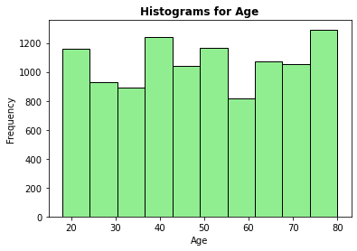

### **Age Boxplot**

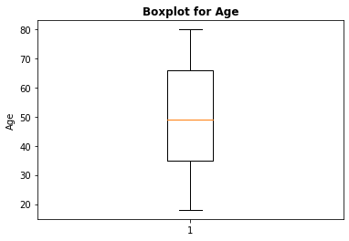

### **Monthly Spend Distribution**

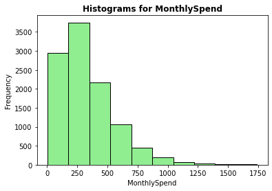

### **Monthly Spend Boxplot**

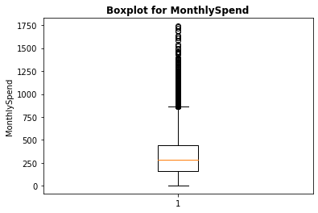

### **Average Monthly Spending by Gender**

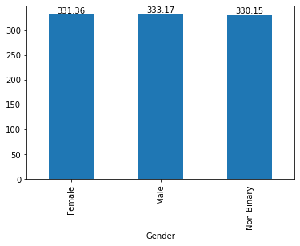

### **Average Monthly Spending by Education**

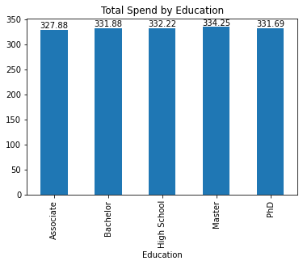

### **Total Spending by State**

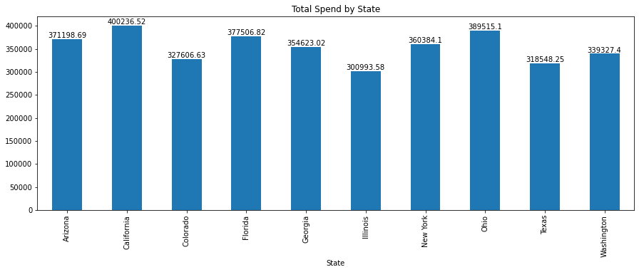

### **Age vs Monthly Spend**

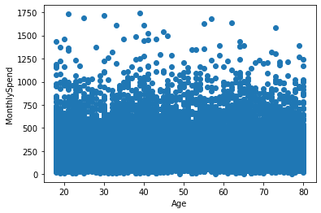

### **Spending Distribution by Education**

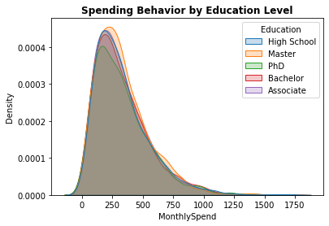

### **Spending Distribution by Marital Status**

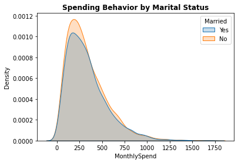

### **Correlation Heatmap**

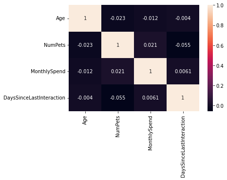

---

## **🔍 Key Insights**

- Monthly spending exhibits a **right-skewed distribution**, indicating the presence of a small number of high-spending customers.
- Customer age is broadly distributed across the dataset.
- Average monthly spending is relatively consistent across different gender groups.
- Customers with higher education levels show slightly higher average spending.
- Spending varies across different states, highlighting regional purchasing trends.
- Correlation analysis indicates weak relationships among the numerical variables.

---

## **📁 Repository Structure**

```text
Customer-Insights-Statistical-Investigation/
│
├── images/
│   ├── age_histogram.png
│   ├── age_boxplot.png
│   ├── monthly_spend_histogram.png
│   ├── monthly_spend_boxplot.png
│   ├── gender_average_spending.png
│   ├── education_average_spending.png
│   ├── state_total_spending.png
│   ├── age_vs_monthly_spend_scatter.png
│   ├── education_spending_kde.png
│   ├── marital_status_spending_kde.png
│   └── correlation_heatmap.png
│
├── stats_mini_project.ipynb
├── Project_Assessment.pdf
└── README.md
```

---

## **🚀 Skills Demonstrated**

- Exploratory Data Analysis (EDA)
- Descriptive Statistics
- Data Visualization
- Statistical Analysis
- Python Programming
- Customer Analytics
- Business Intelligence
- Data Interpretation

---

## **📌 Business Outcome**

The project uncovers valuable insights into customer demographics and spending behavior. These findings can help businesses better understand customer segments, identify purchasing trends, and support data-driven decision-making.

---

## **⭐ Conclusion**

This project demonstrates the practical application of **Python, Statistics, and Exploratory Data Analysis** to analyze customer behavior and generate actionable business insights. It showcases a complete analytical workflow, from data exploration to visualization and interpretation, making it a strong addition to a data analytics portfolio.

---

## **👨‍💻 Author**

**Gagan Bawankule**

**Aspiring Data Analyst**

**Skills:** Python • SQL • Excel • Power BI • Tableau • Statistics
